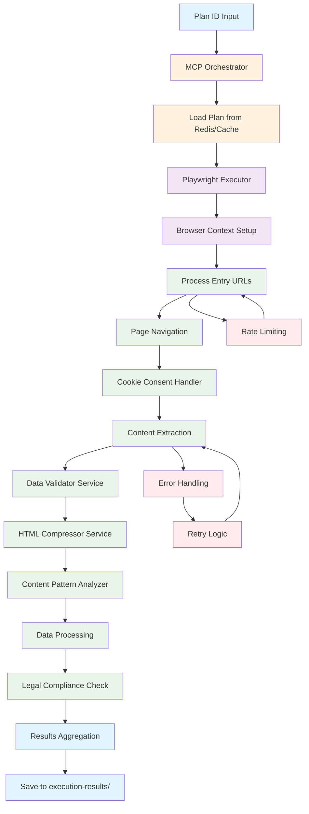
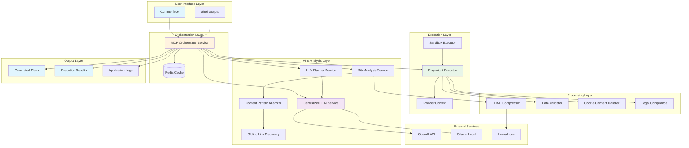

# AI Scraper Service

A comprehensive AI-driven web scraping platform that uses Large Language Models (LLMs) and Playwright for intelligent data extraction. The system generates detailed scraping plans, analyzes website structures, and executes automated scraping with built-in compliance and validation features.

## Project Structure

```
scraper.script/
├── docs/                           # Documentation files
│   ├── PROJECT-STRUCTURE.md       # Project organization guide
│   ├── SETUP-INSTRUCTIONS.md      # Setup and configuration guide
│   ├── README-plan-generator.md   # Plan generator documentation
│   └── *.md                       # Implementation summaries and guides
├── scripts/                        # Utility scripts
│   ├── generate-plan.ts           # Main plan generation script
│   ├── generate-plan.sh           # Unix shell script wrapper
│   ├── generate-plan.bat          # Windows batch script wrapper
│   └── execute-plan.ts            # Plan execution script
├── tests/                          # Test and debugging files
│   ├── test-*.ts                  # Various test files
│   ├── debug-*.ts                 # Debug scripts
│   ├── example-*.ts               # Example usage scripts
│   └── migrate-*.ts               # Migration scripts
├── src/                           # Source code
│   ├── cli/                       # Command-line interface
│   │   └── plan-generator.ts      # Interactive CLI for plan generation
│   ├── interfaces/                # TypeScript interfaces
│   │   └── core.ts                # Core type definitions
│   ├── services/                  # Core services
│   │   ├── centralized-llm.service.ts      # Unified LLM access
│   │   ├── mcp-orchestrator.service.ts    # Main orchestration service
│   │   ├── playwright-executor.service.ts # Browser automation
│   │   ├── site-analysis.service.ts       # Website analysis
│   │   ├── content-pattern-analyzer.service.ts # Pattern recognition
│   │   ├── cookie-consent-handler.service.ts   # Cookie management
│   │   ├── data-validator.service.ts      # Data validation
│   │   ├── html-compressor.service.ts    # HTML optimization
│   │   ├── legal-compliance.service.ts   # Legal compliance checks
│   │   ├── llamaindex-integration.service.ts # LlamaIndex integration
│   │   ├── llm-planner.service.ts        # AI plan generation
│   │   ├── ollamaService.ts              # Ollama LLM integration
│   │   ├── sandbox-executor.service.ts   # Safe testing environment
│   │   ├── sibling-link-discovery.service.ts # Link discovery
│   │   └── index.ts               # Service exports
│   └── utils/                     # Utility functions
│       └── logger.ts              # Logging utilities
├── plans/                         # Generated scraping plans
│   └── *.md                       # Markdown plan files
├── execution-results/             # Execution results
│   └── *.json                     # JSON result files
├── logs/                          # Application logs
├── dist/                          # Compiled JavaScript output
├── package.json                   # Dependencies and scripts
└── tsconfig.json                  # TypeScript configuration
```

## Core Services

### Primary Services
- **MCP Orchestrator Service**: Central coordination service for plan lifecycle management and async task processing
- **Centralized LLM Service**: Unified access to different LLM providers (OpenAI, Ollama) with fallback support
- **Playwright Executor**: Automated browser-based scraping with advanced page processing
- **Site Analysis Service**: Website structure and content analysis using AI
- **LLM Planner Service**: Intelligent plan generation using AI models

### Supporting Services
- **Content Pattern Analyzer**: Pattern recognition and extraction from web content
- **Cookie Consent Handler**: Automated cookie consent management
- **Data Validator Service**: Data quality assurance and validation
- **HTML Compressor Service**: HTML optimization and compression for LLM processing
- **Legal Compliance Service**: Legal compliance checks and GDPR handling
- **Sandbox Executor Service**: Safe testing environment for plans
- **Sibling Link Discovery Service**: Advanced link discovery and analysis
- **LlamaIndex Integration Service**: Integration with LlamaIndex for enhanced processing
- **Ollama Service**: Local LLM integration for offline processing

## Key Features

### Cookie Consent Heuristic-First with LLM 🆕

The system now uses the correct approach: **heuristic search first** to find cookie dialogs and buttons, then **LLM analysis** of only the relevant HTML elements:

- **Heuristic Search First**: Uses efficient heuristic patterns to locate cookie dialogs and buttons
- **LLM Analysis**: Analyzes only the relevant cookie dialog HTML (not the whole page)
- **LLM Verification**: Verifies consent success using only dialog HTML analysis
- **Plan Persistence**: Saves successful plans with verification results for future reuse
- **Learning System**: Tracks success rates and usage statistics for continuous improvement
- **Multi-Step Support**: Handles complex multi-step cookie consent flows (like Cookiebot)
- **German-Optimized**: Specialized prompts for German municipal websites
- **Robust Selectors**: Multiple fallback selectors per step handle dynamic content

```bash
# Test heuristic-first cookie consent handling
npm run test:heuristic-first-cookie-consent

# Test LLM-first cookie consent handling
npm run test:llm-first-cookie-consent

# Test the cookie consent fallback
npm run test:cookie-consent-fallback

# Test LLM plan generation
npm run test:llm-plan-generation
```

For detailed documentation, see [Cookie Consent Heuristic-First](docs/COOKIE-CONSENT-LLM-FALLBACK.md).

### Core Capabilities
- **AI-Driven Plan Generation**: Uses LLMs to analyze websites and create detailed scraping plans
- **Intelligent Content Detection**: Automatically identifies data patterns and structures
- **Multi-Provider LLM Support**: Supports OpenAI and Ollama with automatic fallback
- **Advanced Cookie Consent Handling**: Enhanced cookie consent management with LLM fallback
- **Legal Compliance**: Built-in GDPR and legal compliance checks
- **Data Validation**: Comprehensive data validation and quality assurance
- **German Municipal Optimization**: Specialized for German municipal websites

## Application Flow

The AI Scraper Service follows a comprehensive workflow from plan generation to execution:

### 1. Detailed Plan Generation Flow

```mermaid
flowchart TD
    A[User Input: Website URL] --> B[CLI Interface]
    B --> C[MCP Orchestrator Initialization]
    C --> D[Open Website URL]
    D --> E[Cookie Consent Handler]
    E --> F{Consent Required?}
    F -->|Yes| G[Handle Cookie Consent]
    F -->|No| H[Continue to Content Search]
    G --> H[Search Content URLs]

    H --> I[Heuristic Search Analysis]
    I --> J[Analyze Page Structure]
    J --> K[Identify Content Containers]
    K --> L[Container Analysis Service]
    L --> M[Check Sibling URLs]
    M --> N[LLM Verification of Containers]
    N --> O{Container Valid?}
    O -->|No| P[Refine Container Selection]
    P --> L
    O -->|Yes| Q[Extract Content Patterns]

    Q --> R[Check for Pagination]
    R --> S{Pagination Found?}
    S -->|No| T[Search Pagination URLs]
    T --> U[Heuristic Pagination Detection]
    U --> V[LLM Verification of Pagination]
    V --> W{Pagination Valid?}
    W -->|No| X[Try Alternative Pagination]
    X --> U
    W -->|Yes| Y[Define Pagination Strategy]
    S -->|Yes| Y

    Y --> Z[Generate CSS Selectors]
    Z --> AA[Legal Compliance Check]
    AA --> BB[Rate Limiting Configuration]
    BB --> CC[Create Scraping Plan]
    CC --> DD[Save Plan to Redis/Cache]
    DD --> EE[Generate Markdown Plan File]
    EE --> FF[Save to plans/ directory]

    style A fill:#e1f5fe
    style B fill:#f3e5f5
    style C fill:#fff3e0
    style D fill:#e8f5e8
    style E fill:#e8f5e8
    style G fill:#e8f5e8
    style H fill:#e8f5e8
    style I fill:#e8f5e8
    style J fill:#e8f5e8
    style K fill:#e8f5e8
    style L fill:#e8f5e8
    style M fill:#e8f5e8
    style N fill:#f3e5f5
    style O fill:#ffebee
    style P fill:#ffebee
    style Q fill:#e8f5e8
    style R fill:#e8f5e8
    style S fill:#ffebee
    style T fill:#e8f5e8
    style U fill:#e8f5e8
    style V fill:#f3e5f5
    style W fill:#ffebee
    style X fill:#ffebee
    style Y fill:#e8f5e8
    style Z fill:#e8f5e8
    style AA fill:#e8f5e8
    style BB fill:#e8f5e8
    style CC fill:#e1f5fe
    style DD fill:#e1f5fe
    style EE fill:#e1f5fe
    style FF fill:#e1f5fe
```



**Detailed Process Steps:**

1. **User Input**: User provides website URL and optional content URLs
2. **CLI Interface**: Interactive command-line interface collects user preferences
3. **MCP Orchestrator**: Initializes all required services and connections
4. **Open Website URL**: Loads the main website using Playwright browser
5. **Cookie Consent Handler**: Automatically detects and handles cookie consent dialogs
6. **Content URL Search**: Searches for content URLs if not provided by user
7. **Heuristic Search Analysis**: Uses pattern recognition to identify content areas
8. **Page Structure Analysis**: Analyzes HTML structure and DOM hierarchy
9. **Container Identification**: Identifies potential content containers
10. **Container Analysis Service**: Deep analysis of identified containers
11. **Sibling URL Discovery**: Finds related URLs and content pages
12. **LLM Verification**: Uses AI to verify container selection accuracy
13. **Container Validation**: Validates if containers contain target content
14. **Content Pattern Extraction**: Extracts data patterns and structures
15. **Pagination Detection**: Checks for existing pagination elements
16. **Pagination URL Search**: Searches for pagination URLs if not found
17. **Heuristic Pagination Detection**: Uses patterns to identify pagination
18. **LLM Pagination Verification**: AI verification of pagination strategy
19. **Pagination Strategy**: Defines how to navigate through pages
20. **CSS Selector Generation**: Creates precise CSS selectors for extraction
21. **Legal Compliance Check**: Ensures GDPR and legal compliance
22. **Rate Limiting Configuration**: Sets appropriate delays and limits
23. **Plan Creation**: Generates comprehensive scraping plan
24. **Plan Storage**: Saves plan to Redis cache and markdown file

**Key Service Interactions:**

- **Cookie Consent Handler**: Automatically detects and dismisses cookie consent banners using pattern recognition
- **Heuristic Search**: Uses machine learning patterns to identify content areas without explicit selectors
- **Container Analysis**: Deep analysis of DOM elements to find optimal content containers
- **Sibling Link Discovery**: Finds related pages by analyzing link patterns and page structure
- **LLM Verification**: Uses AI models to validate container selections and pagination strategies
- **Pagination Detection**: Multiple strategies including URL patterns, navigation elements, and content analysis
- **CSS Selector Generation**: Creates robust selectors that work across different page variations

### 2. Plan Execution Flow



**Process:**
1. **Plan Selection**: Choose from generated plans or provide plan ID
2. **MCP Orchestrator**: Manages execution workflow and task coordination
3. **Playwright Executor**: Automated browser-based scraping with advanced features
4. **Browser Setup**: Creates browser context with proper user agent and viewport
5. **URL Processing**: Iterates through entry URLs with rate limiting
6. **Page Navigation**: Handles page loading and navigation
7. **Cookie Consent**: Automated cookie consent management
8. **Content Extraction**: Extracts data using CSS selectors and patterns
9. **Data Validation**: Quality assurance and compliance checking
10. **Results Output**: JSON result files saved to `execution-results/` directory

### 3. System Architecture Overview



### 4. Key Features
- **Intelligent Analysis**: AI-powered website structure analysis
- **Compliance Handling**: Automated cookie consent and legal compliance
- **Rate Limiting**: Configurable delays to respect website resources
- **Error Handling**: Comprehensive error tracking and recovery
- **Validation**: Multi-layer data validation and quality checks
- **Logging**: Detailed logging for debugging and monitoring

## Getting Started

1. **Install dependencies:**
   ```bash
   npm install
   ```

2. **Configure environment variables** (see `docs/SETUP-INSTRUCTIONS.md`):
   - `OPENAI_API_KEY`: OpenAI API key for GPT models
   - `OLLAMA_BASE_URL`: Ollama server URL (default: http://localhost:11434)
   - `REDIS_URL`: Redis connection string for caching
   - `LOG_LEVEL`: Logging level (debug, info, warn, error)

3. **Generate a scraping plan:**
   ```bash
   npm run generate-plan
   ```

4. **Execute a plan:**
   ```bash
   npm run execute-plan -- --plan-id <plan-id> --max-pages 5 --max-items 10
   ```

## Available Scripts

### Plan Generation
- `npm run generate-plan` - Interactive plan generation
- `npm run plan:interactive` - Alias for generate-plan
- `npm run plan:help` - Show help for plan generation

### Plan Execution
- `npm run execute-plan` - Execute a specific plan with options

### Development
- `npm run build` - Compile TypeScript to JavaScript
- `npm run test` - Run test suite
- `npm run lint` - Check code quality
- `npm run clean` - Clean build artifacts

### Shell Scripts
- `scripts/generate-plan.sh` - Unix/Linux plan generation wrapper
- `scripts/generate-plan.bat` - Windows plan generation wrapper

## Output Files

### Generated Plans (`plans/` directory)
- **Format**: Markdown files with detailed scraping strategies
- **Naming**: `scraping-plan-{domain}-{timestamp}.md`
- **Content**: Includes selectors, URLs, extraction patterns, and compliance notes

### Execution Results (`execution-results/` directory)
- **Format**: JSON files with extracted data and metrics
- **Naming**: `execution-{run-id}-{timestamp}.json`
- **Content**: Extracted data, performance metrics, errors, and validation results

### Logs (`logs/` directory)
- **Format**: Structured log files with timestamps
- **Content**: Detailed execution logs, errors, and debugging information

## Documentation

See the `docs/` directory for detailed documentation including:
- **SETUP-INSTRUCTIONS.md**: Complete setup and configuration guide
- **PROJECT-STRUCTURE.md**: Detailed project organization
- **README-plan-generator.md**: Plan generator specific documentation
- **Implementation summaries**: Various enhancement and fix documentation

## Testing

Test files are located in the `tests/` directory for development and debugging purposes:
- **test-*.ts**: Unit and integration tests
- **debug-*.ts**: Debugging scripts for troubleshooting
- **example-*.ts**: Example usage demonstrations
- **migrate-*.ts**: Migration and upgrade scripts
