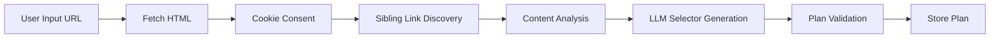
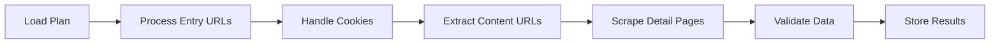

# 🕷️ AI Scraper Service - Technical Overview

> **A comprehensive AI-driven web scraping platform that uses Large Language Models (LLMs) and Playwright for intelligent data extraction from websites.**

---

## 📋 Table of Contents

1. [Executive Summary](#executive-summary)
2. [System Architecture](#system-architecture)
3. [Core Technical Workflow](#core-technical-workflow)
4. [Service Layer Deep Dive](#service-layer-deep-dive)
5. [Data Models & Interfaces](#data-models--interfaces)
6. [AI/LLM Integration](#aillm-integration)
7. [Scraping Process Pipeline](#scraping-process-pipeline)
8. [Infrastructure & Deployment](#infrastructure--deployment)
9. [Key Technical Features](#key-technical-features)

---

## Executive Summary

The AI Scraper Service is an intelligent web scraping platform designed to automatically discover, analyze, and extract structured content from websites. The system combines:

- **AI-Powered Analysis**: Uses LLMs (OpenAI GPT-4o, Ollama, OpenRouter) to understand page structures and generate CSS selectors
- **Browser Automation**: Playwright-based browser pool for dynamic content rendering
- **Plan-Based Execution**: Two-phase approach: Plan Generation → Plan Execution
- **GDPR & Legal Compliance**: Built-in robots.txt and privacy compliance
- **Cookie Consent Handling**: Automated detection and handling of cookie consent dialogs

### Primary Use Case

The system is optimized for scraping **listing-based websites** (municipal websites, news sites, government portals) where:
1. A **main page** contains a list of items (events, articles, announcements)
2. Each list item links to a **detail page** with full content
3. **Pagination** may exist to navigate through multiple pages of listings

---

## System Architecture

### High-Level Architecture Diagram

```
┌─────────────────────────────────────────────────────────────────────────────────┐
│                              USER INTERFACE LAYER                                │
├────────────────────────────────┬────────────────────────────────────────────────┤
│        CLI Interface           │              Shell Scripts                      │
│    (plan-generator.ts)         │      (generate-plan.sh/bat)                    │
└────────────────────────────────┴────────────────────────────────────────────────┘
                                          │
                                          ▼
┌─────────────────────────────────────────────────────────────────────────────────┐
│                           ORCHESTRATION LAYER                                    │
├─────────────────────────────────────────────────────────────────────────────────┤
│                        MCP Orchestrator Service                                  │
│   ┌─────────────────┐  ┌──────────────────┐  ┌────────────────────────┐        │
│   │ Workflow Engine │  │ Queue Management │  │   Redis State Store    │        │
│   └─────────────────┘  └──────────────────┘  └────────────────────────┘        │
└─────────────────────────────────────────────────────────────────────────────────┘
                                          │
                    ┌─────────────────────┼─────────────────────┐
                    ▼                     ▼                     ▼
┌───────────────────────────┐ ┌───────────────────────────┐ ┌───────────────────┐
│    AI/ANALYSIS LAYER      │ │    EXECUTION LAYER        │ │  PROCESSING LAYER │
├───────────────────────────┤ ├───────────────────────────┤ ├───────────────────┤
│ • Centralized LLM Service │ │ • Playwright Executor     │ │ • HTML Compressor │
│ • Content Analysis Svc    │ │ • Browser Pool Manager    │ │ • Data Validator  │
│ • Sibling Link Discovery  │ │ • Sandbox Executor        │ │ • Cookie Handler  │
│ • Plan Factory Service    │ │                           │ │ • Legal Compliance│
└───────────────────────────┘ └───────────────────────────┘ └───────────────────┘
                    │                     │                     │
                    ▼                     ▼                     ▼
┌─────────────────────────────────────────────────────────────────────────────────┐
│                           EXTERNAL SERVICES                                      │
├──────────────────┬──────────────────┬──────────────────┬───────────────────────┤
│    OpenAI API    │   Ollama Local   │   OpenRouter     │   Redis Cache         │
│   (GPT-4o-mini)  │  (llama3.2:3b)   │  (Multi-Model)   │   (State Store)       │
└──────────────────┴──────────────────┴──────────────────┴───────────────────────┘
                                          │
                                          ▼
┌─────────────────────────────────────────────────────────────────────────────────┐
│                              OUTPUT LAYER                                        │
├──────────────────────────┬───────────────────────────┬──────────────────────────┤
│   plans/*.md             │   execution-results/*.json │        logs/             │
│   (Scraping Plans)       │   (Extracted Data)         │   (Application Logs)     │
└──────────────────────────┴───────────────────────────┴──────────────────────────┘
```

### Technology Stack

| Layer | Technology | Purpose |
|-------|------------|---------|
| **Runtime** | Node.js + TypeScript | Application runtime |
| **Browser Automation** | Playwright | Headless browser control |
| **AI/LLM** | OpenAI, Ollama, OpenRouter | Content analysis & selector generation |
| **State Management** | Redis | Plan storage, workflow state, caching |
| **Containerization** | Docker + Docker Compose | Deployment & isolation |

---

## Core Technical Workflow

The system operates in two distinct phases:

### Phase 1: Plan Generation



**Detailed Steps:**

1. **User Input** → Provide website URL and optional content page examples
2. **HTML Fetching** → Playwright browser loads the page with full JavaScript rendering
3. **Cookie Consent** → Automated detection and dismissal of consent dialogs
4. **Sibling Discovery** → Identify related content links using heuristics + LLM
5. **Content Analysis** → Analyze page structure to identify content patterns
6. **Selector Generation** → LLM generates CSS selectors for data extraction
7. **Validation** → Test selectors against live pages
8. **Storage** → Save plan to Redis and generate Markdown documentation

### Phase 2: Plan Execution



**Detailed Steps:**

1. **Load Plan** → Retrieve stored plan from Redis
2. **Navigate** → Visit each entry URL with rate limiting
3. **Cookie Handling** → Use cached consent strategies
4. **URL Extraction** → Find content links using list/content selectors
5. **Detail Scraping** → Visit each content page and extract data
6. **Validation** → Validate extracted data against schema
7. **Results** → Save JSON results to `execution-results/` directory

---

## Service Layer Deep Dive

### 1. MCP Orchestrator Service (`mcp-orchestrator.service.ts`)

**Role**: Central coordination service managing the entire plan lifecycle.

**Key Responsibilities:**
- Workflow state management (6-step plan generation, 5-step execution)
- Redis connection and state persistence
- Service coordination between all components
- Async task processing with queue management

**Workflow Steps (Plan Generation):**
```typescript
const workflowSteps = [
  { stepId: "fetch_html",            name: "Fetch HTML Content" },
  { stepId: "discover_sibling_links", name: "Discover Sibling Links" },
  { stepId: "analyze_content",        name: "Analyze Content Patterns" },
  { stepId: "generate_plan",          name: "Generate Scraping Plan" },
  { stepId: "validate_plan",          name: "Validate Plan" },
  { stepId: "store_plan",             name: "Store Plan" }
];
```

### 2. Centralized LLM Service (`centralized-llm.service.ts`)

**Role**: Unified access layer for all LLM providers.

**Provider Support:**
| Provider | Model | Use Case |
|----------|-------|----------|
| **OpenAI** | gpt-4o-mini | Primary selector generation, content analysis |
| **Ollama** | llama3.2:3b | Local/fallback processing |
| **OpenRouter** | Multi-model | Flexible routing, cost optimization |

**Key Features:**
- Automatic fallback between providers
- Request/response tracking for debugging
- JSON response format support
- Dynamic configuration updates

**Usage Pattern:**
```typescript
const llmService = getCentralizedLLMService();
const response = await llmService.generate({
  prompt: "Analyze this HTML and generate CSS selectors...",
  systemMessage: "You are an expert web scraping assistant...",
  format: 'json',
  service: 'content-analysis',
  method: 'generateSelectors'
});
```

### 3. Playwright Executor Service (`playwright-executor.service.ts`)

**Role**: Browser automation for page navigation and content extraction.

**Key Features:**
- **Browser Pool**: Maintains 3 concurrent browser instances
- **Rate Limiting**: Configurable delays between requests
- **Retry Logic**: Automatic retry for failed requests
- **Content Extraction**: Field-by-field data extraction using CSS selectors

**Content Extraction Flow:**
```
Entry URL → Extract Content URLs → Visit Each Detail Page → Extract Fields
     │              │                       │                    │
     ▼              ▼                       ▼                    ▼
  List Page   listSelector           contentLinkSelector   detailSelectors
```

**Supported Field Types:**
- `title`, `description` → Text content
- `images` → Image src attributes (converted to absolute URLs)
- `website` → Link href attributes
- `price`, `discountPrice` → Parsed numeric values
- `startDate`, `endDate`, `dates` → ISO 8601 date parsing
- `address`, `email`, `phone` → Contact information
- `zipcode`, `longitude`, `latitude` → Location data

### 4. Sibling Link Discovery Service (`sibling-link-discovery.service.ts`)

**Role**: Intelligent discovery of related content links on a page.

**Discovery Methods:**
1. **Heuristic Pattern Matching** → URL structure analysis
2. **Container-Based Discovery** → Find parent containers with multiple links
3. **LLM-Assisted Analysis** → AI verification of discovered containers

**Key Output:**
- `containerSignature` → CSS selector for the content container
- `contentLinkSelector` → Precise selector for content links
- `siblingLinks[]` → Array of discovered content URLs

### 5. Content Analysis Service (`content-analysis.service.ts`)

**Role**: Analyze content pages to generate detail selectors.

**Process:**
1. Fetch multiple content pages (batch of 3-5)
2. Trim HTML to main content areas (remove headers, footers, nav)
3. Compress HTML for LLM processing (max 20,000 chars)
4. Send to LLM for selector generation
5. Return validated `detailSelectors` map

### 6. Cookie Consent Handler (`cookie-consent-handler.service.ts`)

**Role**: Automated detection and handling of cookie consent dialogs.

**Detection Strategies:**
| Strategy | Description |
|----------|-------------|
| **Heuristic-First** | Pattern matching for known consent libraries (Cookiebot, OneTrust) |
| **LLM Fallback** | AI analysis when heuristics fail |
| **Domain Caching** | Store successful strategies per domain |
| **Selector Reuse** | Use stored selectors from plan metadata |

**Consent Options:**
- `accept-all` → Click "Accept All" button
- `reject-all` → Click "Reject All" button
- `minimal` → Accept only essential cookies
- `ai-decide` → Let LLM choose optimal strategy

### 7. HTML Compressor Service (`html-compressor.service.ts`)

**Role**: Optimize HTML content for LLM processing.

**Compression Techniques:**
- Remove comments, scripts, styles
- Remove non-content elements (nav, footer, aside)
- Chunked processing with relevance scoring
- LlamaIndex integration for advanced summarization

**Performance:**
- Typical 70-80% size reduction
- Maintains structural integrity for selector generation

### 8. Plan Factory Service (`plan-factory.service.ts`)

**Role**: Assemble final ScrapingPlan from analysis results.

**Plan Structure:**
```typescript
interface ScrapingPlan {
  planId: string;           // Unique identifier
  version: number;          // Plan version
  entryUrls: string[];      // Starting URLs
  listSelector: string;     // CSS selector for list container
  contentLinkSelector?: string;  // Selector for content links
  paginationSelector?: string;   // Selector for next page
  detailSelectors: Record<string, string>;  // Field→Selector map
  rateLimitMs: number;      // Delay between requests
  retryPolicy: RetryPolicy; // Retry configuration
  confidenceScore: number;  // AI confidence (0-1)
  metadata: PlanMetadata;   // Domain info, compliance, cookies
}
```

---

## Data Models & Interfaces

### ExtractedItem (Output Schema)

```typescript
interface ExtractedItem {
  // Required
  title: string;
  description: string;
  dates: string[];         // ISO 8601 array
  images: string[];        // Absolute URLs
  language: 'de' | 'en';

  // Optional
  place?: string;
  address?: string;
  email?: string;
  phone?: string;
  website?: string;
  price?: number;
  discountPrice?: number;
  longitude?: number;
  latitude?: number;
  startDate?: string;      // ISO 8601
  endDate?: string;        // ISO 8601
  createdAt?: string;      // ISO 8601
  zipcode?: number;
  sourceUrl?: string;      // Content page URL
}
```

### PlanMetadata

```typescript
interface PlanMetadata {
  domain: string;
  siteType: 'municipal' | 'news' | 'government';
  language: string;
  createdBy: 'ai' | 'human';
  robotsTxtCompliant: boolean;
  gdprCompliant: boolean;
  cookieConsent?: {
    detected: boolean;
    strategy: string;
    library: string;
    selectors: Record<string, string>;
    acceptButtonSelector?: string;
    rejectButtonSelector?: string;
    handledSuccessfully: boolean;
  };
}
```

### Execution Metrics

```typescript
interface ExecutionMetrics {
  duration: number;         // Total execution time (ms)
  itemsExtracted: number;   // Total items scraped
  pagesProcessed: number;   // Pages visited
  errorsEncountered: number;
  accuracyScore: number;    // Data completeness (0-1)
  tokensUsed?: number;      // LLM tokens consumed
}
```

---

## AI/LLM Integration

### When LLM is Used

| Phase | Use Case | LLM Role |
|-------|----------|----------|
| **Plan Generation** | Container Analysis | Verify content containers identified by heuristics |
| **Plan Generation** | Selector Generation | Generate CSS selectors for detail pages |
| **Plan Generation** | Pagination Detection | Identify pagination patterns |
| **Execution** | Cookie Consent (fallback) | Analyze cookie dialogs when heuristics fail |

### LLM Request Tracking

All LLM requests are tracked with:
- Service name and method
- Provider and model used
- Tokens consumed
- Response time
- Success/failure status

### Prompt Engineering

Example prompt for content analysis:
```
You are an expert web scraping assistant analyzing HTML to identify content selectors.

Given the following HTML from content pages:
[COMPRESSED_HTML]

Analyze the structure and return JSON with:
{
  "detailSelectors": {
    "title": "CSS selector for title",
    "description": "CSS selector for description",
    ...
  },
  "confidence": 0.0-1.0,
  "reasoning": "Explanation of selector choices"
}
```

---

## Scraping Process Pipeline

### Complete Flow: URL → Extracted Data

```
┌────────────────────────────────────────────────────────────────────────────────┐
│                          PLAN GENERATION PHASE                                  │
└────────────────────────────────────────────────────────────────────────────────┘

1. USER INPUT
   └─→ Website URL: https://example.com/events
   └─→ Content URLs (optional): https://example.com/events/event-1

2. FETCH & PREPARE
   └─→ Playwright loads page with JavaScript
   └─→ Cookie consent detected and handled
   └─→ Full HTML content captured

3. SIBLING LINK DISCOVERY
   └─→ Analyze provided content URLs
   └─→ Find container with similar links
   └─→ Generate contentLinkSelector
   └─→ Discover additional sibling links
   └─→ Output: Enhanced URL list + container info

4. CONTENT ANALYSIS (LLM)
   └─→ Fetch 3-5 content pages
   └─→ Compress HTML (remove nav, ads, etc.)
   └─→ Send to LLM for selector generation
   └─→ Output: detailSelectors map

5. PLAN ASSEMBLY
   └─→ Combine: listSelector + contentLinkSelector + detailSelectors
   └─→ Add pagination selector if detected
   └─→ Include cookie consent metadata
   └─→ Calculate confidence score

6. VALIDATION & STORAGE
   └─→ Test selectors on live page
   └─→ Store in Redis
   └─→ Generate Markdown documentation


┌────────────────────────────────────────────────────────────────────────────────┐
│                          PLAN EXECUTION PHASE                                   │
└────────────────────────────────────────────────────────────────────────────────┘

1. LOAD PLAN
   └─→ Retrieve plan from Redis by planId
   └─→ Apply execution options (maxPages, maxItems, testMode)

2. PROCESS ENTRY URLS
   For each entry URL:

   2.1 Navigate with rate limiting
   2.2 Handle cookie consent (using cached strategy)
   2.3 Extract content URLs using listSelector/contentLinkSelector

   2.4 For each content URL:
       └─→ Navigate to detail page
       └─→ Extract data using detailSelectors
       └─→ Validate and normalize data
       └─→ Add to results collection

   2.5 Check for pagination
       └─→ If paginationSelector matches → get next page URL
       └─→ Continue processing (up to maxPages)

3. RESULT AGGREGATION
   └─→ Validate all extracted items
   └─→ Calculate accuracy metrics
   └─→ Save to execution-results/*.json
   └─→ Update plan metrics in Redis
```

### Selector Hierarchy

```
LISTING PAGE (entry URL)
├── listSelector: ".event-list article"
│   └── Targets: Container/items holding content links
│
├── contentLinkSelector: ".event-list article a.event-link"
│   └── Targets: Specific links within list items
│
└── paginationSelector: "a.next-page, [rel='next']"
    └── Targets: Next page navigation link

DETAIL PAGE (content URL)
├── detailSelectors.title: "h1.event-title, .event-header h1"
├── detailSelectors.description: ".event-content, article p"
├── detailSelectors.date: ".event-date, time[datetime]"
├── detailSelectors.address: ".event-location, .address"
└── detailSelectors.images: ".event-gallery img, article img"
```

---

## Infrastructure & Deployment

### Docker Compose Architecture

```yaml
services:
  app:
    build: .
    depends_on:
      - redis
    environment:
      - REDIS_URL=redis://redis:6379/0
      - OPENAI_API_KEY=${OPENAI_API_KEY}
    volumes:
      - ./plans:/usr/src/app/plans
      - ./execution-results:/usr/src/app/execution-results
      - ./logs:/usr/src/app/logs

  redis:
    image: redis:7-alpine
    ports:
      - "6379:6379"
```

### Environment Variables

| Variable | Purpose | Default |
|----------|---------|---------|
| `OPENAI_API_KEY` | OpenAI API access | Required for OpenAI |
| `OLLAMA_BASE_URL` | Ollama server URL | `http://localhost:11434` |
| `OPENROUTER_API_KEY` | OpenRouter access | Optional |
| `REDIS_URL` | Redis connection | `redis://localhost:6379/0` |
| `LLM_PRIMARY_PROVIDER` | Default LLM | `openai` |
| `LLM_FALLBACK_PROVIDER` | Fallback LLM | `ollama` |
| `COOKIE_CONSENT_STRATEGY` | Default consent | `accept-all` |
| `LOG_LEVEL` | Logging verbosity | `info` |

### Resource Requirements

| Component | Memory | CPU | Notes |
|-----------|--------|-----|-------|
| App (Node.js) | 1-2 GB | 1-2 cores | Browser pool uses significant memory |
| Playwright Browsers | 500 MB each | Variable | Default: 3 browsers |
| Redis | 512 MB | 0.5 cores | Caching and state |

---

## Key Technical Features

### 1. Browser Pool Management

The system maintains a pool of headless Chromium browsers:
- Default: 3 concurrent browsers
- Automatic acquisition/release
- Graceful shutdown handling
- Error recovery with browser restart

### 2. Rate Limiting & Politeness

```typescript
// Default rate limiting
rateLimitMs: 1000  // 1 second between requests

// Retry policy
retryPolicy: {
  maxAttempts: 3,
  backoffStrategy: 'exponential',
  baseDelayMs: 1000,
  maxDelayMs: 10000
}
```

### 3. Data Validation

Extracted data is validated against the schema:
- Required fields: `title`, `description`
- Date format: ISO 8601
- URLs: Resolved to absolute paths
- Images: Extracted and converted to absolute URLs

### 4. Cookie Consent Optimization

Performance optimization for cookie handling:
- **Plan-based**: Use selectors from plan generation (1-2 seconds)
- **Heuristic-first**: Pattern matching before LLM (70-80% faster)
- **Domain caching**: Cache successful strategies

### 5. LLM Token Optimization

- HTML compression before LLM processing
- Chunked analysis for large pages
- Targeted prompts for specific tasks
- Response caching where applicable

---

## Output Files

### Generated Plans (`plans/*.md`)

```markdown
# 🕷️ Scraping Plan Report

**Plan ID:** plan_1699876543_abc123def
**Target URL:** https://example.com/events
**Confidence:** 85.5%

## Detail Selectors
| Field | Selector |
|-------|----------|
| title | h1.event-title |
| description | .event-content |
| date | time[datetime] |

## Cookie Consent
| Property | Value |
|----------|-------|
| Detected | ✅ |
| Library | Cookiebot |
| Strategy | accept-all |

## Complete Plan (JSON)
```json
{ ... full plan object ... }
```
```

### Execution Results (`execution-results/*.json`)

```json
{
  "runId": "run_1699876543",
  "planId": "plan_abc123",
  "status": "completed",
  "extractedData": [
    {
      "title": "Community Event",
      "description": "Annual community gathering...",
      "dates": ["2024-03-15T10:00:00Z"],
      "images": ["https://example.com/image1.jpg"],
      "language": "de",
      "sourceUrl": "https://example.com/events/1"
    }
  ],
  "metrics": {
    "duration": 15234,
    "itemsExtracted": 25,
    "pagesProcessed": 3,
    "errorsEncountered": 0,
    "accuracyScore": 0.92
  }
}
```

---

## Summary

The AI Scraper Service represents a sophisticated approach to web scraping that combines:

1. **AI Intelligence** → LLMs for understanding page structure and generating selectors
2. **Robust Automation** → Playwright for reliable browser control
3. **Compliance Built-In** → Cookie consent, GDPR, robots.txt handling
4. **Plan-Based Architecture** → Separation of analysis and execution for efficiency
5. **Scalable Design** → Docker-ready, Redis-backed, configurable resources

The two-phase approach (Plan Generation → Plan Execution) allows for:
- Human review of generated plans before execution
- Plan reuse across multiple runs
- Incremental improvement of selectors
- Efficient scraping with cached strategies

---

*Document generated for AI Scraper Service v1.0*
*Last updated: December 2024*
